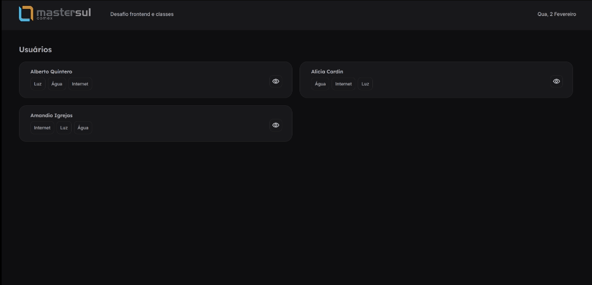

<div align="center" id="top"> 
  

  &#xa0;

  <!-- <a href="https://frontend.netlify.app">Demo</a> -->
</div>

<h1 align="center">Frontend</h1>

<p align="center">
  <a href="#dart-sobre">Sobre</a> &#xa0; | &#xa0; 
  <a href="#sparkles-funcionalidades">Funcionalidades</a> &#xa0; | &#xa0;
  <a href="#rocket-tecnologias">Tecnologias</a> &#xa0; | &#xa0;
  <a href="#white_check_mark-requisitos">Requisitos</a> &#xa0; | &#xa0;
  <a href="#checkered_flag-instalacao">Instalação</a> &#xa0; | &#xa0;
  <a href="https://github.com/victor47n" target="_blank">Autor</a>
</p>

<br>

## :dart: Sobre ##

Projeto frontend proposto pela Mastersul, com o objetivo de consumir as informações de uma api
e manipular os dados recebidos.

## :sparkles: Funcionalidades ##

:heavy_check_mark: Consumo de API;
:heavy_check_mark: Manipulação de dados;

## :rocket: Tecnologias ##

As seguintes ferramentas foram utilizadas neste projeto:

- [React](https://pt-br.reactjs.org/)
- [NextJS](https://nextjs.org/)
- [Axios](https://github.com/axios/axios)
- [Date-fns](https://date-fns.org)
- [Sass](https://sass-lang.com/)
- [TypeScript](https://www.typescriptlang.org/)

## :white_check_mark: Requisitos ##

Antes de começar :checkered_flag:, você precisa ter [Git](https://git-scm.com) e [Node](https://nodejs.org/en/) instalados.

## :checkered_flag: Instalação ##

```bash
# Clonar o projeto
$ git clone https://github.com/victor47n/desafio-mastersul

# Acessar
$ cd desafio-mastersul
$ cd TesteLogicaFrontEndEClasses
$ cd frontend

# Instalar as dependências
$ yarn

# Executar o projeto
$ yarn start

# O servidor será inicializado em <http://localhost:3000>
```
## :memo: Autor ##

Feito com :heart: por <a href="https://github.com/victor47n" target="_blank">Victor Hugo da Silva</a>

&#xa0;

<a href="#top">Voltar ao topo</a>
